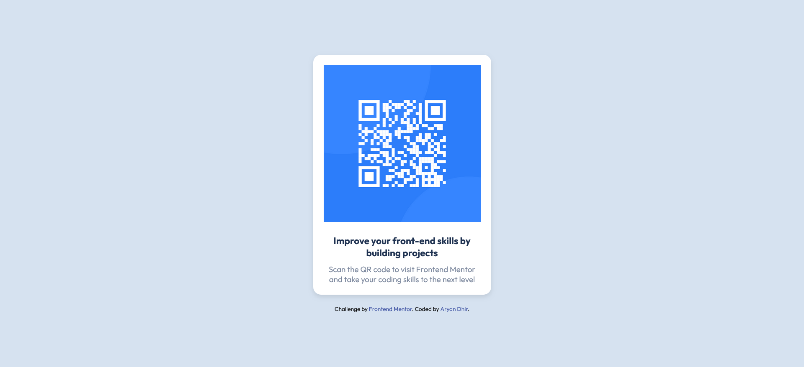
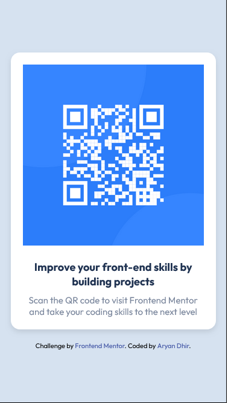

# Frontend Mentor - QR code component solution

This is a solution to the [QR code component challenge on Frontend Mentor](https://www.frontendmentor.io/challenges/qr-code-component-iux_sIO_H). Frontend Mentor challenges help you improve your coding skills by building realistic projects. 

## Table of contents

- [Overview](#overview)
  - [Screenshot](#screenshot)
  - [Links](#links)
  - [Built with](#built-with)
  - [What I learned](#what-i-learned)
  - [Continued development](#continued-development)
  - [Useful resources](#useful-resources)
- [Author](#author)

## Overview
HTML Structure: 
I structured the main content within a div classed as qr-container, which includes a nested div   with the class qr-card. This card contains an image of the QR code, a heading, and a paragraph that explains the QR code's purpose.

Styling: 
I utilized external stylesheets for the layout and styling, and incorporated Google Fonts for improved typography.

Responsiveness: 
I ensured the component is adaptable to various device widths using the meta viewport tag.

Attribution: 
The page includes an attribution section that links to Frontend Mentor and credits me, Aryan Dhir, as the coder.

This project serves as an excellent practice tool for beginners aiming to improve their HTML and CSS skills by creating a visually appealing and functional web component.
### Screenshot

### Links

- Solution URL: (https://github.com/aryandhir03/QR_code_frontend_mentor_challenge.git)
- Website URL: (https://aryandhir03.github.io/qrcode/)

### Built with

- Semantic HTML5 markup
- CSS custom properties
- Flexbox
- CSS Grid

### What I learned

Throughout the development of the QR code component, I gained valuable insights and improved my skills in several areas. Here are some highlights and code snippets that I'm particularly proud of:

- ### HTML: Semantic Structure
I focused on creating a clean and semantic HTML structure. This not only helps with SEO but also makes the code easier to read and maintain. Here's an example of how I structured the main component:
'''

  

    
    <h1>Improve your front-end skills by building projects</h1>
    
Scan the QR code to visit Frontend Mentor and take your coding skills to the next level

  

'''

- #### CSS: Responsive Design
I applied CSS techniques to ensure the component is responsive and looks good on any device. Using Flexbox helped me manage layout adjustments dynamically. Here's a snippet that I'm proud of, which ensures the text and image are aligned beautifully:

'''.qr-container {
  display: flex;
  justify-content: center;
  align-items: center;
  height: 100vh;
}

.qr-card {
  background: white;
  padding: 20px;
  box-shadow: 0 4px 8px rgba(0,0,0,0.1);
  text-align: center;
}'''

### Continued development

I'm planning to build a few more cool projects before I dive into creating my portfolio website. I've realized that having a diverse set of projects to show off can really make my portfolio stand out. But, I've got to admit, sometimes my creativity gets the best of me and I end up making things more complicated than they need to be! 😅

So, I'm working on keeping things simple and focusing more on making my designs user-friendly rather than just fancy. Here’s what I’m looking to sharpen up:
- **Responsive Design**: I want to get even better at making sites look great on any device, diving deeper into CSS tricks and layouts.
- **JavaScript Skills**: I’m aiming to boost my JavaScript game, maybe even get into frameworks like React to spice up my projects.
- **Performance Optimization**: As I add more to my portfolio, I need to keep those loading times quick and the performance smooth.
- **User-Centered Design**: I’m also brushing up on UX/UI principles to make sure my projects aren’t just cool but also easy and enjoyable to use.

By focusing on these areas, I hope to smooth out the bumps on the road to building an awesome portfolio. Here's to making things simpler and learning loads along the way!

### Useful resources

- (https://uiverse.io/) - I have to say this is best site for front-end dev. and as for me in my student life as learning frontend this helps a lot in building amaings thing as it has pre build components which we can use in our projects. 
- (@websitebrainy) - This is an UX/UI design based insta page and this is one of the best page I have seen so far as it has so many websites design that you can use in your projects.

## Author

- Website - [Aryan Dhir]([https://www.your-site.com](https://aryandhir03.github.io/qrcode/))
- Frontend Mentor - [@aryandhir03](https://www.frontendmentor.io/profile/@aryandhir03)
